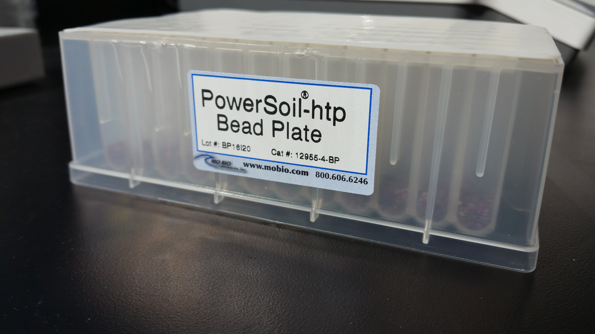

#Purpose

We are looking into the bacterial community compostion of soil, an important component of ecological systems. The bacterial marker gene (16S rRNA gene) extraction kits target the highly conserved 16S marker gene. Because of the slow rates of evolution of this region of the gene, we can use them to reconstruct a phylogeny of our sample.  

#PPE
  1. Gloves
  2. Eye protection
  3. Lab coat

#Materials

  01. Soil samples
  02. Micro-balance
  03. 70% ethanol
  04. Funnels
  05. Wigh boats and or weigh paper
  06. Spatulas
  07. Alcohol flame
  08. Data sheet
  09. 97 well Bead Plate
  
<a style='text-decoration: none; color: black;'>
  
  
97 well Bead Plate
</a>

#Procedure:

  01. Remove soil samples from -80 freezer, location:

    note: to preserve samples as best as possible, remove only 1 group at a time. 
  02. Layout samples on the bench, from first set, to match the order that the samples are in on the datasheet.
  03. Sterilize goves/hands with 70% ethanol.
  04. Sterilize spatulas by making sure they are clean and then flaming them. 
  05. Using sterile spatula and weigh paper, sub sample 0.23 g to 0.25 g of soil into weigh boat.
  06. Record mass of soil on datasheet, confirm that it is the correct sample.
  07. Place fresh funnel in target well and slowly transfer soil from weigh boat into funnel and well.
  08. Repeat two more time for three technical replicates. 
  09. Grab or clean your spatula and get a new weigh boat and repeat steps 5-6 for the remaining samples in the set.
  10. Repeat step 3.
  11. Repeat steps 4-7 for all sets of samples
